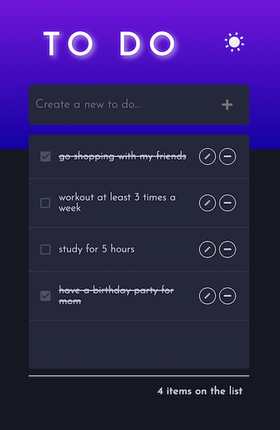
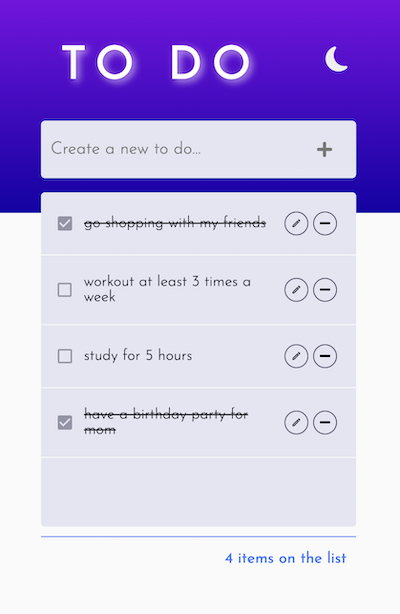

# To Do List

리액트로 구현한 To Do List입니다.

## Table of contents

- [Overview](#overview)
  - [Features](#features)
  - [Screenshot](#screenshot)
  - [Links](#links)
- [My process](#my-process)
  - [Built with](#built-with)
  - [What I learned](#what-i-learned)
  - [Continued development](#continued-development)
- [Author](#author)

## Overview

### Features

- 스크린 크기별 반응형 구현
- 투두리스트 추가, 수정, 삭제
- 완료된 투두리스트 체크
- 투두리스트 남은 개수 표시
- 다크모드/라이트모드 토글 기능
- 로컬스토리지 저장 및 불러오기

<!--
Users should be able to:

- View the optimal layout for the app depending on their device's screen size
- Add new todos to the list
- Update todos
- Mark todos as complete
- Delete todos from the list
- Toggle light and dark mode
-->

### Screenshot




### Links

- Live Site URL: [https://thisisyeji.github.io/Todo_prac/](https://thisisyeji.github.io/Todo_prac/)

## My process

### Built with

- [React](https://reactjs.org/) - JS library
- [Styled Components](https://styled-components.com/) - For styles

### What I learned

- 리스트 수정 기능

```js
const onUpdate = (id, newToDo) => {
	if (!newToDo) return alert('할 일을 입력하세요.');
	setTodos((todos) =>
		todos.map((todo) => (todo.id === id ? { ...todo, text: newToDo } : todo))
	);
};
```

- ThemeProvider를 활용하여 다크모드/라이트 모드 토글

- 투두 리스트 전체 개수 중 완료 체크된 개수 제외하기

```js
const undoneTasks = todos.filter((todo) => !todo.checked);
	return (
		<>
		...생략...
			<Total>{undoneTasks.length} items on the list</Total>
		</>
```

### Continued development

- 추가하고 싶은 기능

1. 투두 리스트 전체 개수 중 완료 체크된 개수 제외하기(완료)
2. 다크모드/라이트모드 로컬스토리지에 저장하기(완료)

## Author

- Github - [김예지 Yeji Kim](https://github.com/thisisyeji)
